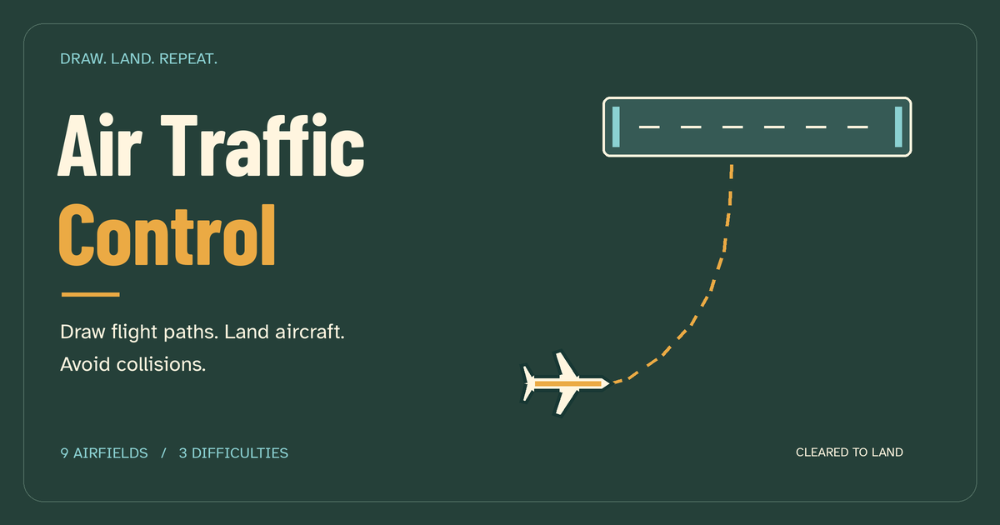

# Air Traffic Control

Draw flight paths. Land aircraft. Avoid collisions.

Air Traffic Control is a browser arcade game for short, increasingly busy air-traffic shifts. Guide three aircraft types to matching destinations across nine airfields, unlock new locations through a local career, and collect achievements.



## Play

Choose an airfield and **Easy**, **Medium**, or **Hard**, then select **Play**. The **How to play** page includes a practice flight.

1. Press an aircraft with your mouse, finger, or pen and hold.
2. Draw a route to the destination with its matching color and letter. Release when the landing area lights up.
3. Keep aircraft apart. Red warning rings indicate nearby traffic; draw a new route to reroute an aircraft.

| Aircraft | Destination |
| --- | --- |
| Cyan airliner | Runway marked **L** |
| Amber commuter | Runway marked **C** |
| Coral helicopter | Helipad marked **H** |

Each safe landing earns one point. A collision or an aircraft leaving the sector ends the shift. Pause with the on-screen control or **Escape**. Changing screen orientation or size may require restarting the shift; the pause screen explains when the previous layout can be restored.

## Airfields and progression

Start at **Saltmarsh Gateway** or **River Bend**. Career promotions unlock Desert Parallel, Twin Banks, Falcon Air Base, Executive Point, Metro International, Freight Junction, and Island Rescue. Military, business, passenger, cargo, and rescue settings share the game's visual style and core routing rules.

Difficulty changes aircraft arrival frequency, speed, and traffic limits. Best scores are tracked separately for each airfield, difficulty, and screen orientation.

Seven career ranks and nine achievements reward safe landings, mixed aircraft handling, exploring airfields, and completing demanding shifts. Progress is recorded when a shift finishes. Restarting or abandoning an unfinished shift discards that shift's progress; practice flights do not affect records or achievements.

## Run locally

Use **Node.js 24** and **npm 11**. The repository uses npm and `package-lock.json`.

```bash
git clone https://github.com/montasim/air-traffic-control.git
cd air-traffic-control
npm ci
npm run dev
```

Open the local URL printed by Vite, choose an airfield, and start a flight. No API keys, accounts, backend, or environment variables are required.

| Command | Purpose |
| --- | --- |
| `npm run dev` | Start the development server |
| `npm test` | Run the Vitest suite once |
| `npm run test:watch` | Watch tests during development |
| `npm run typecheck` | Check TypeScript |
| `npm run build` | Type-check and build production assets into `dist/` |
| `npm run preview` | Serve the production build locally |

## Saves, sound, and offline use

Career progress, achievements, records, selected airfield, difficulty, and audio settings are stored locally in IndexedDB. There is no account system or cloud synchronization. Clearing site data can erase progress; save export and import are not implemented. Development and production sites have separate browser storage.

Sound and effects volume are adjustable in Settings. Browsers may require a player interaction before audio starts.

The production build includes a service worker that caches game assets. A first online visit is required; after caching, the game can be reopened offline. Installation and offline behavior depend on browser support. Use HTTPS in production. The development server does not represent the production offline experience.

Menus support keyboard navigation, but drawing flight paths requires a pointer. Responsive layouts have been checked in Chromium; real-device Safari, native touch feel, and long-session difficulty balance still need broader playtesting. See the [end-to-end QA report](docs/end-to-end-qa-report.md) for verification scope.

## Build and deploy

```bash
npm ci
npm test
npm run build
npm run preview
```

Publish the **contents of `dist/`** to a static HTTPS host. The app uses hash routes such as `/#help`, `/#career`, and `/#settings`; it requires no server functions or history-route fallback. Asset paths assume the root of a domain, not a GitHub Pages repository subdirectory.

[netlify.toml](netlify.toml) declares the build command, Node version, and publish directory. Manual Netlify uploads must use a fresh local build and `--no-build` to avoid a second remote build. Linking a site and authentication are deployment-operator responsibilities; local Netlify state is ignored by Git.

GitHub Actions runs the tests and production build on pushes to `main` and pull requests. CI validation does not itself deploy the game.

## Project structure

| Path | Responsibility |
| --- | --- |
| `src/core/` | Framework-independent traffic simulation and geometry |
| `src/game/` | Phaser rendering, pointer input, and airfield definitions |
| `src/progression/` | Career ranks and achievements |
| `src/storage/` | IndexedDB saves and migrations |
| `src/audio/` | Game audio |
| `src/ui/` | DOM menus and utility pages |
| `tests/` | Simulation, progression, storage, audio, and UI regression tests |
| `public/` | Bundled fonts, graphics, and public assets |

Built with TypeScript, Phaser, Vite, Vitest, and Hugeicons. [DESIGN.md](DESIGN.md) describes the visual direction. Historical plans in `docs/` describe development decisions, not promises of future features. Some storage identifiers retain the former name, Vector Approach, to preserve existing saves.

## Contributing and support

Read [CONTRIBUTING.md](CONTRIBUTING.md) before opening a pull request. Report reproducible bugs or suggestions through [GitHub issues](https://github.com/montasim/air-traffic-control/issues), including browser, airfield, difficulty, and steps to reproduce. Do not post private information or exploitable security details in a public issue.

## License

The project is available under the [MIT license](LICENSE). Bundled fonts retain their own notices in [public/fonts/licenses](public/fonts/licenses); dependencies retain their respective licenses.
