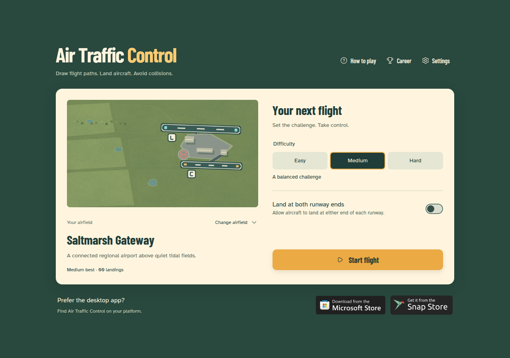

# Air Traffic Control

> Draw flight paths. Land aircraft. Avoid collisions.

[](https://github.com/montasim/air-traffic-control/actions/workflows/ci.yml)
[](LICENSE)
[](https://www.supportkori.com/montasim)

Air Traffic Control is a browser arcade game for short, increasingly busy air-traffic shifts. Guide three aircraft types to matching destinations across nine airfields, unlock new locations through a local career, and collect achievements.

**[Play in your browser](https://airtrafficcontrol.netlify.app/) · [How to play](#how-to-play) · [Run locally](#run-locally) · [Report a bug](https://github.com/montasim/air-traffic-control/issues)**

### Get the desktop app

<a href="https://apps.microsoft.com/detail/9N5536ZQ2XZM"></a>
<a href="https://snapcraft.io/air-traffic-control"></a>

Windows: [Microsoft Store](https://apps.microsoft.com/detail/9N5536ZQ2XZM). Linux: [Snap Store](https://snapcraft.io/air-traffic-control). Check each listing for device requirements and the available release. Store versions and the live site may differ from the latest source.

[](https://airtrafficcontrol.netlify.app/)

*Start screen captured from the current local source. The published app may show an earlier version.*

## What you can do

- Draw and revise routes with a mouse, touch, or pen across nine airfields.
- Match airliners, commuters, and helicopters to their landing destinations.
- Choose three difficulty levels and optionally allow landings at either runway end.
- Learn in a practice flight with no timer or effect on your career.
- Unlock airfields through seven ranks and earn nine achievements.
- Keep progress on your device and play offline once the browser app is cached.

## How to play

[Open Air Traffic Control](https://airtrafficcontrol.netlify.app/) in your browser, or launch an installed copy.

Choose an airfield and **Easy**, **Medium**, or **Hard**, then select **Start flight**. The **How to play** page includes a practice flight.

1. Press an aircraft with your mouse, finger, or pen and hold.
2. Draw a route to the destination with its matching color and letter. By default, use the highlighted end. Enable **Land at both runway ends** below difficulty to use either end. Both settings accept any approach angle. Release when the landing area lights up.
3. Keep aircraft apart. Red warning rings indicate nearby traffic; draw a new route to reroute an aircraft.

| Aircraft | Destination |
| --- | --- |
| Cyan airliner | Runway marked **L** |
| Amber commuter | Runway marked **C** |
| Coral helicopter | Helipad marked **H** |

The runway setting is remembered for your next shift and stays fixed during a shift, including resizing. Personal bests and career progress are shared across both settings.

Any aircraft that reaches its matching runway end lands, even if another aircraft is landing on the same runway. Helipads keep their usual landing behavior.

Each safe landing earns one point. A collision or an aircraft leaving the sector ends the shift. Pause with the on-screen control or **Escape**. Resizing preserves the shift and pauses when needed; select **Resume** once the field is large enough to play.

## Airfields and progression

Start at **Saltmarsh Gateway** or **River Bend**. Career promotions unlock Desert Parallel, Twin Banks, Falcon Air Base, Executive Point, Metro International, Freight Junction, and Island Rescue. Military, business, passenger, cargo, and rescue settings share the game's visual style and core routing rules.

The top of the career adds three frontier maps:

- **Frost Crossing** (Chief Controller): two runways cross in a snowbound archipelago.
- **Carrier Coast** (Flight Director): liners land at a shore airfield, commuters on a carrier offshore.
- **Blue Water** (Air Boss): open ocean and one carrier deck, with axial and angled lanes, two deck helipads, and no liners.

Carrier decks are landed from the stern only, in both runway-end modes.

Difficulty changes aircraft arrival frequency, speed, and traffic limits. Best scores are tracked separately for each airfield, difficulty, and screen orientation.

Seven career ranks and nine achievements reward safe landings, mixed aircraft handling, exploring airfields, and completing demanding shifts. Progress is recorded when a shift finishes. Restarting or abandoning an unfinished shift discards that shift's progress; practice flights do not affect records or achievements.

## Run locally

Use **Node.js 24** (`.nvmrc` and CI) and **npm 11.13.0** (the declared package manager). The repository uses npm and `package-lock.json`; no database or separate service is needed.

```bash
git clone https://github.com/montasim/air-traffic-control.git
cd air-traffic-control
npm ci
npm run dev
```

Open the local URL printed by Vite, normally [http://localhost:5173](http://localhost:5173), choose an airfield, and start a flight. No API keys, accounts, backend, or environment variables are required.

| Command | Purpose |
| --- | --- |
| `npm run dev` | Start the development server |
| `npm test` | Run the Vitest suite once |
| `npm run test:watch` | Watch tests during development |
| `npm run typecheck` | Check TypeScript |
| `npm run build` | Type-check and build production assets into `dist/` |
| `npm run preview` | Serve the production build locally |

## Linux desktop

The Electron version bundles the game for offline play on Linux x86-64, with separate
local saves from the browser version.

Install the published Linux release from the Snap Store:

```bash
sudo snap install air-traffic-control
```

```bash
npm run desktop       # Build and run Electron
npm run package:linux # Build an AppImage in release/
npm run package:snap  # Build a strictly confined core24 Snap (requires Snapcraft + LXD)
```

The repository currently configures Linux x86-64 packaging; it does not include a Windows packaging or Microsoft Store publishing workflow.

See [Linux builds and Snap Store publishing](docs/linux-release.md) for prerequisites,
verification, installation, and publishing commands.

## Microsoft Store (Windows)

Build the Windows x64 MSIX for **Sky Routes: Air Traffic Control** with
`npm run package:msix`; the registered Partner Center identity is configured.
See [Microsoft Store release](docs/microsoft-store.md)
for the exact commands, local test packaging, and submission checklist.

## Android (Google Play)

The Android app wraps the same build in Capacitor (`android/`). Run
`npm run android:sync` to build and copy the game into the Android project,
`npm run android:open` to open it in Android Studio, and `npm run package:android`
for a signed Play bundle. Gradle needs JDK 21. See [Android release](docs/android-release.md)
for signing, icons, verification, and Play Console setup.

## Saves, sound, and offline use

Career progress, achievements, records, selected airfield, difficulty, and audio settings are stored locally in IndexedDB. There is no account system or cloud synchronization. Clearing site data can erase progress; save export and import are not implemented. Development and production sites have separate browser storage.

Sound and effects volume are adjustable in Settings. Browsers may require a player interaction before audio starts.

The production build includes a service worker that caches game assets. A first online visit is required; after caching, the game can be reopened offline. Installation and offline behavior depend on browser support. Use HTTPS in production. The development server does not represent the production offline experience.

Store links and the **Support** link in Settings open third-party websites in a new tab (or the system browser in Electron). The Android app hides them. Those pages require an internet connection and handle their own account or payment information; the game does not embed a payment form.

## Status and limitations

The project is in its **0.x release series**. It is an arcade game, not an operational air-traffic-control simulator.

Menus support keyboard navigation, but drawing flight paths requires a pointer. Responsive layouts have been checked in Chromium; real-device Safari, native touch feel, and long-session difficulty balance still need broader playtesting. See the [end-to-end QA report](docs/end-to-end-qa-report.md) for verification scope.

## Build and deploy

```bash
npm ci
npm test
npm run build
npm run preview
```

Publish the **contents of `dist/`** to a static HTTPS host. The app uses hash routes such as `/#help`, `/#career`, and `/#settings`; it requires no server functions or history-route fallback. Asset paths assume the root of a domain, not a GitHub Pages repository subdirectory.

[netlify.toml](netlify.toml) declares the build command, Node version, and publish directory. For a manual upload, build locally first and upload the fresh `dist/` contents. Site authentication and linking are deployment-operator responsibilities; local Netlify state is ignored by Git.

The [CI workflow](.github/workflows/ci.yml) runs the tests and production build on pushes to `main` and pull requests. CI validation does not itself deploy the game. The [Linux desktop workflow](.github/workflows/linux-desktop.yml) builds and smoke-tests an AppImage on manual dispatch or a `v*` tag, then uploads a workflow artifact; it does not publish to either store.

For browser regression checks, start `npm run dev -- --port 4287` in one terminal. In another, run `npm run test:resize`, `npm run test:resize:maps`, or `npm run test:runway-ends`. Use `RESIZE_TEST_URL=http://localhost:4287/ npm run test:runway-mode` for the runway-option checks. These scripts use Playwright: provide Chrome through `CHROME_PATH`, use `/usr/bin/google-chrome`, or install its bundled browser with `npx playwright install chromium`. Desktop smoke-test prerequisites are in the [Linux release guide](docs/linux-release.md#verify).

## Project structure

| Path | Responsibility |
| --- | --- |
| `src/core/` | Framework-independent traffic simulation and geometry |
| `src/game/` | Phaser rendering, pointer input, and airfield definitions |
| `src/progression/` | Career ranks and achievements |
| `src/storage/` | IndexedDB saves and migrations |
| `src/audio/` | Game audio |
| `src/ui/` | DOM menus and utility pages |
| `src/platform/` | Android-only native integration (back button, outbound links) |
| `android/` | Capacitor Android project |
| `tests/` | Simulation, progression, storage, audio, and UI regression tests |
| `public/` | Bundled fonts, graphics, and public assets |

The DOM menus configure a shift; Phaser translates pointer input into routes for the simulation. Simulation events drive aircraft rendering, sound, and landing feedback. Completed shifts feed progression and local save storage.

Built with TypeScript, Phaser, Vite, Vitest, and Hugeicons; Electron supplies the desktop shell and Capacitor the Android shell. [DESIGN.md](DESIGN.md) describes the visual direction. Historical plans in `docs/` describe development decisions, not promises of future features. Some storage identifiers retain the former name, Vector Approach, to preserve existing saves.

## Documentation

- [Contribution guide](CONTRIBUTING.md): setup, required checks, and save compatibility.
- [Linux builds and releases](docs/linux-release.md): packaging, installation, verification, and Snap publishing.
- [Android release](docs/android-release.md): Capacitor build, signing, and Google Play publishing.
- [End-to-end QA report](docs/end-to-end-qa-report.md): recorded browser checks and remaining coverage gaps.
- [Mobile verification](docs/mobile-verification.md): device-layout verification notes.
- [Visual design](DESIGN.md): interface conventions.

## Contributing and support

Read [CONTRIBUTING.md](CONTRIBUTING.md) before opening a pull request. Report reproducible bugs or suggestions through [GitHub issues](https://github.com/montasim/air-traffic-control/issues), including browser, airfield, difficulty, and steps to reproduce. Do not post private information or exploitable security details in a public issue.

For security-sensitive problems, do not open a public issue containing exploit details. The repository does not currently publish a dedicated security policy or private disclosure contact. It also has no separate code of conduct; keep contributions respectful and focused.

## Support the project

Optional financial support is available through [SupportKori](https://www.supportkori.com/montasim). You can also help by reporting reproducible bugs, testing on real devices, improving documentation, or contributing code.

## Author

Built and maintained by [Montasim](https://github.com/montasim).

## License

The project is available under the [MIT license](LICENSE). Bundled fonts retain their own notices in [public/fonts/licenses](public/fonts/licenses); dependencies retain their respective licenses. Store badges and logos have separate attribution and terms documented in [public/assets/stores/README.md](public/assets/stores/README.md).
